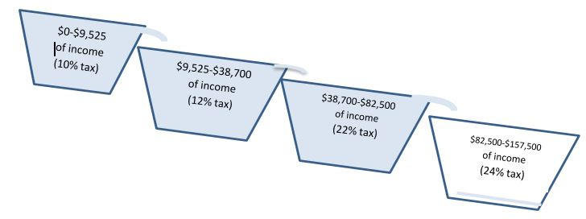
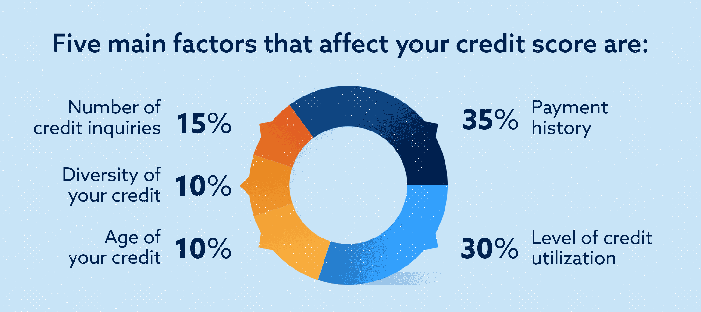
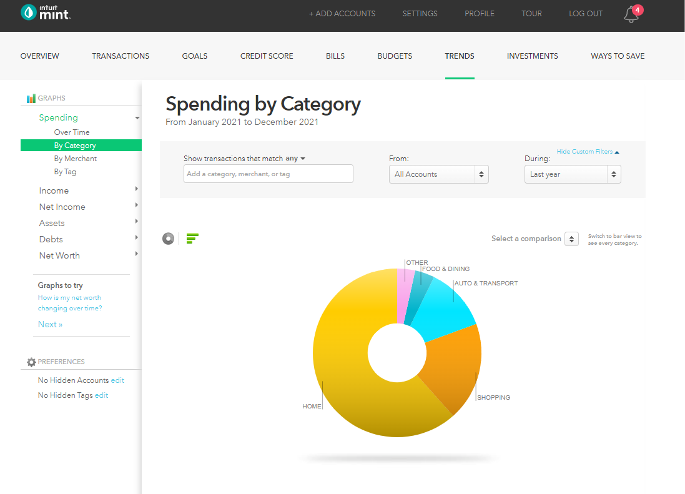
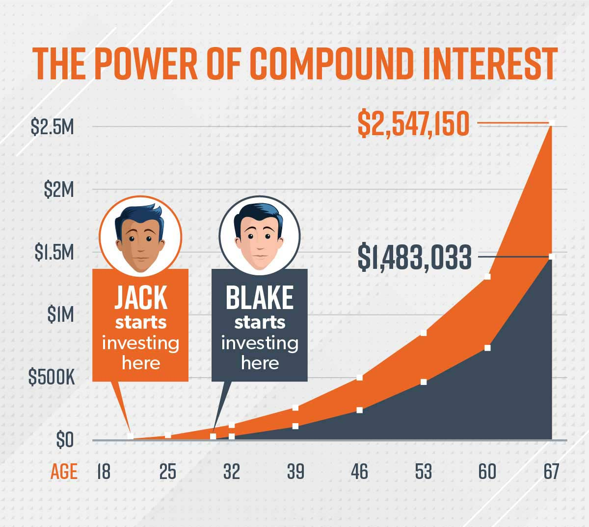

# **Finances 101**

# Table of Contents
- [Fundamentals](#fundamentals)
- [Taxes](#taxes)
- [Credit and Debt](#credit-and-debt)
- [Investing](#investing)

# Fundamentals
## The Power of Money
- Happiness - income  and **liquid** net worth is [highly correlated with happiness](https://www.pnas.org/doi/epdf/10.1073/pnas.2208661120). More money, less (serious) problems
- Leverage - money allows you to make decisions from a position of strength. For example: It's a lot easier to find your dream job when you can afford to be unemployed for a few months. 
- Time - You spend a large portion of your life exchanging time, the most precious resource you have, for money. With wise financial decisions you can minimize the amount of time you waste slaving away for corporate overlords.
- Like literal survival - food, water, shelter. These things cost money

## ALWAYS Do the Thing That Makes Sense
Always take win-win situations. Always take no lose situations. There's surprisingly a lot of these situations in life that we don't take. Things like getting a [good credit score](#credit-and-debt), calling around to get deals on insurance, taking a [401k match](#-tax-advantaged-investing), and applying for scholarships are all examples of things that have great upside and little downside.

However, a lot of people don't do these things, either because they are lazy, scared of rejection, or they would have to be in an uncomfortable situation. Consistently doing the things that make sense over the course of a lifetime will put you miles ahead of others.

## Live under your means
It does not matter how much money you make, if your lifestyle costs close to or above the amount you make, you will not be able to gain financial independence. From small things like eating out often, to big things like buying expensive vehicles or buying the most expensive house you can afford, this principle should be considered in every aspect of your life. Moreover, the more you live under your means, the faster you will be able to achieve financial independence and even retire early.

This does not mean you should never treat yourself, buy luxury goods, or spend money on thing that are not strictly necessary. Rather, you should carefully consider how the habits you create and the expenses you incur, fit into your financial future, and whether they will create value or happiness for you. It is also important to recognize that you can convince yourself of anything, therefore you should check in with yourself to make sure you're not deluding yourself when it comes to making financial decisions. This is especially true for large decisions such as, buying a home, buying a car, renting a place, making a large investment.

## Little things add up over time
This concept applies to interest in [investing](#investing) or loans. Small habits like buying coffee every day not only can cost lots of money over time but cost you the opportunity to invest that money instead. 

Some examples:
- $5 coffee every weekday = $25/week = $1,300/year = $26,000/ 20 years
    - now if you invested the money above month in an [S&P 500](#sp-500) index fund for a 20 year period you would have made $66,644.69 for a total savings of $92,644.69 (assuming historical average return of 11%)
- a 0.53% difference in interest rate for a $650K mortgage will cost you an extra $86,400 over the course of a 30 year loan.
- Contributing $200 a month to an [S&P 500](#sp-500) index fund for 20 years will net you $115,121.45 in profit for a total of $163,121.45

# Taxes
## Income Tax
Income tax is the  tax you pay on earned income. 
https://smartasset.com/taxes/california-paycheck-calculator

Note: none of the images shown are up-to-date with current tax rates

The US uses a tax bracketing system as shown below(2023).

|Tax rate|Taxable income bracket|Tax owed|
|---|---|---|
|10%|$0 to $11,000.|10% of taxable income.|
|12%|$11,001 to $44,725.|$1,100 plus 12% of the amount over $11,000.|
|22%|$44,726 to $95,375.|$5,147 plus 22% of the amount over $44,725.|
|24%|$95,376 to $182,100.|$16,290 plus 24% of the amount over $95,375.|
|32%|$182,101 to $231,250.|$37,104 plus 32% of the amount over $182,100.|
|35%|$231,251 to $578,125.|$52,832 plus 35% of the amount over $231,250.|
|37%|$578,126 or more.|$174,238.25 plus 37% of the amount over $578,125.|

There is a common misconception of how taxes work. Many people believe that once you are in an certain income range, you pay the corresponding percentage on your entire income. For example if you make over $84,200 you pay 24% on your total income. However, this is not the case. 

Tax brackets only show you the tax rate you will pay on each portion of your taxable income. For example: using the image below, if you make $80k you are in the 22% tax bracket, but you do not pay 24% of your income in taxes. You pay 10% on your first $11,000 (+$1,100), then you pay 12% on your income from $11,001 to $44,725 (+$4,047), finally you pay 22% on your remaining income i.e. $44,726 to $80,000 (+$7,760) for a total of $12,907, which is only 16.1%(this number is called your effective tax rate) of your $80,000. This system means you will NEVER make less money after taxes from earning more.

[Video Explanation](https://www.youtube.com/watch?v=SJL4UT4wAxc&ab_channel=TDAmeritrade)

## Capital Gains Tax
Capital gains tax is a tax you pay on the appreciation(increase in value) of an asset (e.g. stock, real estate, etc.). For example: if you buy a stock share for $200 and sell it later for $300, you only pay capital gains tax on the $100 profit. Capital gains tax is only paid when you sell the asset for a profit. Capital gains taxes use a similar tax bracket system as income tax. Capital gains taxes are split up into 2 categories, long term (for assets held over one year) and short term(for assets held under 1 year).

Long term gains are taxed separately from, but based on, your normal taxable income income as shown below(2023):

|Tax-filing status|0% tax rate|15% tax rate|20% tax rate|
|---|---|---|---|
|Single|$0 to $44,625.|$44,626 to $492,300.|$492,301 or more.|
|Married, filing jointly|$0 to $89,250.|$89,251 to $553,850.|$553,851 or more.|
|Married, filing separately|$0 to $44,625.|$44,626 to $276,900.|$276,901 or more.|
|Head of household|$0 to $59,750.|$59,751 to $523,050.|$523,051 or more|

Short term capital gains are taxed as [income tax](#income-tax) in addition to any other taxable income. See the table in [income tax](#income-tax) for the 2023 tax brackets

## Write-offs/ Tax deductions
Write offs reduce the amount of taxable income you have. Say you made $100,000 from your freelance photography business this year. Normally you would pay about $18,021 in taxes. However, purchases for your business can be written off. So let's say that you spent $40,000 on camera equipment and job-related travel. Now your taxable income would be $60,000 and the amount of taxes you would pay is $8,948. This concept also applies to tax-advantaged accounts like 401k's

### Standard Deduction
Everyone can deduct $12,550 from their income instead of tabulating their other deductions. So if you have less than $12,550 in deductions(most people), it is better to just take the standard deduction. Note that this deduction only applies to your personal income. Business write offs are calculated separately, such that you can still take the standard deduction as well as write off business expenses

# Credit and Debt

## Bad Debt vs. Good debt
Some factors that go into good debt:
1. generates equity
2. you use the cash you are "saving" to make alternative investments that yield higher returns than your interest rate
3. provides or replaces something necessary
4. use of the debt creates more returns than you pay in principal and interest. Caveat: just because something generates better returns than interest, this does not necessarily mean that it is an optimal use of debt
5. does not violate the principle of [living within your means](#live-under-your-means)

Generally you want to hit three or more of the above (point 4 typically is always good debt).
Note: points 2 and 4 can be somewhat speculative because you can never truly know how any investment will play out.

Bad Debt Examples:
- Payday loans: Never do this.
- Most credit card debt: credit card debt almost never has an interest rate low enough to fulfill point 2 or 4. Moreover, credit cards are rarely utilized in a manner that fulfills any of the other points. Caveats: see [credit cards](#credit-cards)
- Some auto loans: if your vehicle does not meet point 2 and 5 (or point 4, e.g. rental car) it is likely bad debt

Good Debt examples:
- House - the common example of good debt, houses generate equity, they also replace a necessary cost (housing, in the form of rent), that would not generate equity. Typically, interest rates on homes are lower than average returns on [S&P 500](#sp-500) so you can use your cash "savings" on other investments. 
- Good investments - often things like financing rental properties or business loans can satisfy point 4, making them good debt.
- Some auto loans - if you need a vehicle, financing a car within your means can and utilizing your cash savings for an alternative investment

[Loan interest calculator](https://www.calculator.net/loan-calculator.html)

## Credit score

Credit scores not only affect how much your loans get approved for, they also affect your interest rate. Having good credit is free money. It cost no money, and will save you TONS of money in the long run. 

Here is an example using scores/rates based on the time of writing (9/13/2023):

| Credit Score | Interest rate for a mortgage | Monthly cost  for a $650K home | Total Cost over 30 year loan |
 | ------------ | ---------------------------- | ------------------------------ | ---------------------------- |
 | 770          | 7.64%                        | $4,607                         | $1.658 M                     |
 | 680          | 8.17%                        | $4,847                         | $1.745 M                     |
 | Difference   | 0.53%                         | $240                           | $86,400                      |

 

### Payment History
Your credit reports reveal your payment history, or whether you've consistently paid bills and other obligations on time. FICO says payment history accounts for 35% of your score. You want to have a high amount of on-time payments and zero missed payments.

### Credit utilization
The amount of your credit limit you use, expressed as a percentage, is called credit utilization. FICO says the amount of available credit you use counts for 30% of your score. Your bank reports your credit utilization every month. This means if you need good credit (e.g. for applying for a loan), you can pay down all your debts right before it is reported

### Length of Credit
The  average length of time you’ve had credit. Longer is better, so keep old accounts open unless there is a compelling reason to close them, such as an annual fee on a card you no longer use. For example: if you have two credit cards that have been open for 10 years each and you just got an auto loan last month, your average age of credit is 6.66 years =  (10 + 10 + 0) / 3

### Credit Mix
The kinds of credit you have. It's best to have a mix of installment accounts — those with a set number of equal payments, such as car payments or mortgages — and credit card accounts.

### Credit Inquiries
Number of recent "hard inquiries" on your account. Each application that causes a hard inquiry on your credit may take a few points off your score. However, the effect of these drop off significantly after a few months are completely erased in two years

### Building credit: Easy mode
The simplest way to build credit is to set up auto-pay for a relatively small bill (e.g. Netflix) with your credit card (ideally one with no annual fee) and set up your credit card to automatically pay your credit card bill **IN-FULL**. Keep your oldest 2-3 cards open forever.

## Credit Cards
Credit cards can be scary because of extremely high interest rates. However, they also have their uses so should not be neglected.

The most important thing to know is that you are only charged interest if you don't pay your bill in full each month. ALWAYS set your credit cards to auto-pay IN FULL(double check this, because many banks will default automatic payments to only pay the minimum). NEVER let your debt roll into the next month.

Reasons to use credit cards:
- to improve your [credit score](#credit-score)
- cash back - most cards give some sort of incentives 1-5% of each purchase. It's not much, but it's free money, and we always want free money.
- sign up bonuses - many cards offer sign up bonuses, usually some amount of money or points if you spend a certain amount of money within the first few months of opening your card. This can be good to know if you are planning on getting a new credit card anyway or you can open a new credit card if you know you are going to spend a lot of money in a short period of time(e.g. you're moving and need to furnish your new home). It is important to keep in mind how this will affect your [credit score](#credit-score) and plan accordingly.
- security - credit cards are generally more secure against theft and fraudulent activities. [more info](https://www.nerdwallet.com/article/credit-cards/credit-card-vs-debit-card-safer-online-purchases#:~:text=The%20bottom%20line,online%20or%20swiping%20in%20store.)

## Track Your Money
What gets measured, gets managed. Track your spending, savings and investments. I recommend using [Mint](https://mint.intuit.com/overview.event), it can track spending, investments, bank accounts, credit score and more, you can also make budgets, view trends etc. It will also alert you with any unusual behavior.

# Investing

## Simple version of how to invest
Set up an investment account with [Vanguard](https://personal1.vanguard.com/mmx-move-money/welcome) and set up automatic transactions to regularly put in a set amount of money into an investment account that tracks the [S&P 500](#sp-500). For Vanguard, the the fund that tracks the S&P 500 is VFIAX.

## Why? aka the long version
Historically the S&P 500 has returned ~11% each year (7% increase in purchasing power if you adjust for inflation). 2021 returned 26.8%. That means if you had invested 100k on January 1, 2021 you would have made $26,800 that year. $26,800 in free money. But that is just one year, we haven't even gotten to compound interest.

Compound Interest Baby. Imagine you invest $100k. Now every year you make roughly $11k in free money. But it's even better than that. Because after the first year, now you have $111k invested. So making 11% of that the second year makes you $12.2k. and the year after that: $13.6k and so on and so forth.

Doubling time is a good way to get a grasp of how wild compound interest is. Assuming a rate of increase of 11%, your money will double every 6.6 years. You have 100k invested, in 6.6 years you now have 200k; in 13.2 years, 400k; 19.8 years, 800k; 26.4 years 1.6 MILLION FUCKING dollars. and so on. Insane. So needless to say, you want to invest as MUCH as possible as SOON as possible, because your money will be worth exponentially more the longer it is invested. 

You cannot afford to not invest. If you put $200 in your savings account every month, in 30 years you will have saved a whopping total of $72,000. If you have invested in the S&P 500 you will have about $400,000 at the end of 30 years.

## Index Funds
An index fund is a type of [mutual fund](#mutual-funds) or exchange-traded fund ([ETF](#etfs)) with a portfolio constructed to match or track the components of a financial market index, such as the Standard & Poor's 500 Index (S&P 500). This is different from a normal mutual fund which is managed by a human.

## Mutual funds
A mutual fund is a collection of hundreds or thousands of stocks and/or bonds, managed by "experts", in a single fund.

## ETFs
An ETF (exchange-traded fund) is a collection of hundreds or thousands of stocks or bonds, managed by "experts", in a single fund. It is bought as a single, whole share. For example: if one share costs $400 you cannot buy $200 worth of that ETF

## S&P 500
The S&P 500 is a stock market index tracking the performance of 500 largest companies listed on stock exchanges in the United States. It is one of the most commonly followed equity indices.

## High yield savings account (HYSA)
Like a normal savings account but with a higher interest rate. Typically a very "safe" option. This is a great option for mitigating risk, holding your emergency fund, or holding money mid-term for an investment e.g. a down payment on a house

## Bonds
Bonds are like an "I owe you", you give money to some entity and they promise to give you back a certain amount. US treasury bonds are considered a "safe" investment(though they typically yield less than other investments)

## Tax-Advantaged Investing

### 401k
- Always take employer match
- Pre-tax contributions - whatever you contribute now gets deducted from your taxable income. e.g. if you make $80k and contribute $20k, your taxable income is $60k
- $22.5k limit per year
- Incur penalty and taxes if withdrawn on contributions and earnings before age 59.5
    - [Exceptions](https://www.investopedia.com/retirement/relief-401k-hardship-withdrawals/) 
- Pay taxes later when you withdraw after age 59.5. Taxes are paid as [income tax](#income-tax), not [capital gains](#capital-gains-tax)
    - The benefits for is increase of initial purchasing power
    - High likely hood that you are in a lower tax bracket when older

### Roth IRA
- Post tax contributions - contributions do not get deducted from taxable income
- $6.5k limit per year
- Don't have to pay taxes or penalties on CONTRIBUTIONS ever (I still wouldn't recommend withdrawing early, but it's nice to have the peace of mind)
- Don't have to pay taxes or penalties on EARNINGS after age 59.5
    - There are some exceptions for this like $10k for first time home purchase, disability, etc.

### Health Savings Account HSA
- Triple tax advantage
    - No tax on contributions
    - No tax on earnings
    - No tax on withdrawing for qualified medical expenses
- Requires a qualified high deductible health plan insurance
- You can pay all your qualified expenses up front(save your receipts) and then withdraw the equivalent amount, tax free, at any time.
- Maximum annual contribution of $3,850 (single)
- If distributions are made from an HSA to pay for anything other than a qualified medical expense, that amount is subject to both income tax and an additional 20% tax penalty. However, once an individual turns 65, the 20% tax penalty is eliminated, and only income tax would apply for non-qualified withdrawals

Note:
with all of these accounts, you still have to invest your funds in some sort of asset e.g. mutual fund, etf, bond, stock. Otherwise it's just like putting your money in a bank account

## Calculating returns
Understanding how to calculate return on investment and return on equity, can help you optimize your investments

### Return on investment
Calculating return on investment (ROI) is simple: the percentage difference between the money you put into an investment and the money you get out.

E.g. if you buy a stock for $100 and sell it for $110 your return on investment is 10% ((110 - 100) / 100 = 0.10)

#TODO

### Return on equity
#TODO

### Opportunity Cost
Opportunity cost is the loss of potential gain from other alternatives when one alternative is chosen. 

e.g. if you buy a rental property, you lose the opportunity use the money you invested in the property to invest in the stock market. Even if you make money on your rental, if your ROI would be higher in the stock market, then the rental wasn't the best investment.

# Retiring Early

## What does it take to retire early
To retire early you want to be able to enough money invested or generating passive income to withdraw money from your investments indefinitely.

A simple rule of thumb: if you have 25 times your annual expenses invested, you should be able to retire. e.g. if I spend $50,000 a year, I need to have $1.25 M in assets in order to retire and sustain my lifestyle indefinitely. This is another reason it is important to [live under your means](#live-under-your-means), the less you need to sustain your lifestyle, the less you need to save to retire.

At the most basic level, you can think of it like this: imagine you have your stash of retirement savings invested in stocks or other assets. They pay dividends and appreciate in price at a total rate of 7% per year, before inflation. Inflation eats 3% on average, leaving you with 4% to spend reliably, forever

More information and generally a treasure trove of financial information can be found at the [Mr. Money Moustache blog](https://www.mrmoneymustache.com/2012/05/29/how-much-do-i-need-for-retirement/)

Step by step flowchart

# Buying a House (work in progress)
## Escrow
## Agents
### Redfin

# Misc.
## Churning

Things to show:
How contributing and investing differ for retirement accounts
[returns](#calculating-returns)